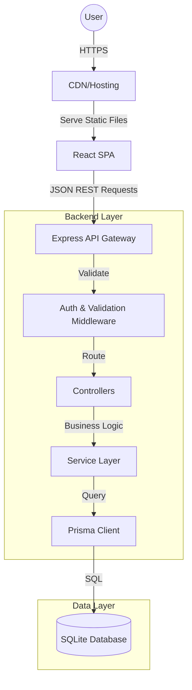

# GearGuard - Industrial Maintenance Management System


## 📋 Table of Contents

1. [📖 Project Overview](#-project-overview)
    - [The Problem](#the-problem)
    - [The Solution](#the-solution)
    - [Target Audience](#target-audience)
2. [✨ Key Features](#-key-features)
    - [🔐 Authentication & Security](#-authentication--security)
    - [📊 Dashboard & Analytics](#-dashboard--analytics)
    - [🚜 Equipment Management](#-equipment-management)
    - [🔧 Maintenance Requests](#-maintenance-requests)
    - [👥 Team & User Management](#-team--user-management)
    - [📈 Reports & Exporting](#-reports--exporting)
3. [💻 Technology Stack](#-technology-stack)
    - [Frontend Architecture](#frontend-architecture)
    - [Backend Architecture](#backend-architecture)
    - [Database & ORM](#database--orm)
    - [DevOps & Tools](#devops--tools)
4. [🏗 System Architecture](#-system-architecture)
    - [High-Level Design](#high-level-design)
    - [Data Flow](#data-flow)
    - [Design Patterns Used](#design-patterns-used)
5. [✅ Prerequisites](#-prerequisites)
6. [🚀 Installation & Setup Guide](#-installation--setup-guide)
    - [1. Clone the Codebase](#1-clone-the-codebase)
    - [2. Backend Configuration](#2-backend-configuration)
    - [3. Database Setup](#3-database-setup)
    - [4. Frontend Configuration](#4-frontend-configuration)
    - [5. Running Locally](#5-running-locally)
7. [🔧 Environment Variables](#-environment-variables)
8. [📡 API Documentation](#-api-documentation)
    - [Authentication Endpoints](#authentication-endpoints)
    - [Equipment Endpoints](#equipment-endpoints)
    - [Maintenance Request Endpoints](#maintenance-request-endpoints)
    - [Team Endpoints](#team-endpoints)
9. [🗄 Database Schema Design](#-database-schema-design)
    - [Entity Relationship Diagram (ERD)](#entity-relationship-diagram-erd)
    - [Model Details](#model-details)
10. [📂 Project Structure Deep Dive](#-project-structure-deep-dive)
    - [Backend Structure](#backend-structure)
    - [Frontend Structure](#frontend-structure)
11. [🛠 Development Guide](#-development-guide)
    - [Coding Standards](#coding-standards)
    - [Adding a New Feature](#adding-a-new-feature)
    - [Testing](#testing)
12. [🔮 Future Roadmap](#-future-roadmap)
13. [🤝 Contributing](#-contributing)
14. [📄 License](#-license)
15. [📞 Contact & Support](#-contact--support)

---

## 📖 Project Overview

### The Problem
In the modern industrial sector, **unplanned downtime** is a silent killer of productivity. Factories and plants often rely on disjointed systems—spreadsheets, whiteboards, and legacy software—to track equipment health and maintenance schedules. This leads to:
-   **Inefficiency:** Technicians don't know what to prioritize.
-   **Data Silos:** Managers lack a real-time view of the floor.
-   **Compliance Risks:** Missed preventive maintenance schedules.
-   **High Costs:** Reactive repairs are 10x more expensive than preventive ones.

### The Solution
**GearGuard** is a comprehensive **Industrial Maintenance Management System (IMMS)** designed to solve these challenges. It serves as a unified digital platform that connects:
1.  **Assets**: A digital twin of every machine.
2.  **People**: Technicians, managers, and admins.
3.  **Processes**: Work orders, schedules, and approvals.

By digitizing these workflows, GearGuard enables "Zero Downtime" manufacturing, ensuring critical assets are monitored, maintained, and repaired efficiently.

### Target Audience
-   **Plant Managers**: For high-level visibility of operations.
-   **Maintenance Supervisors**: To assign teams and track SLAs.
-   **Technicians**: To view their daily tasks and log work.
-   **Auditors**: To verify maintenance history for compliance.

---

## ✨ Key Features

GearGuard is built with a "Premium Enterprise" aesthetic and functionality.

### 🔐 Authentication & Security
Security is paramount in industrial systems.
-   **JWT (JSON Web Tokens)**: We use stateless authentication. Upon login, the client receives an `accessToken` valid for the session.
-   **Bcrypt Hashing**: User passwords are irreversibly hashed before storage using `bcrypt` with a salt round of 10.
-   **Role-Based Access Control (RBAC)**:
    -   `ADMIN`: Full system access, invite users, delete data, configure system settings.
    -   `MANAGER`: Can create equipment, assign teams, and view all reports.
    -   `TECHNICIAN`: Read-only view of assets, can only update assigned requests.
    -   `USER`: Basic view access (if applicable).
-   **Protected Routes**: Frontend `AuthGuard` components prevent unauthorized access to specific pages.

### 📊 Dashboard & Analytics
The landing command center for operations.
-   **KPI Cards**: Immediate visibility into:
    -   Total Equipment Count
    -   Open Maintenance Requests
    -   Critical Alerts
    -   Team Efficiency
-   **Interactive Charts**:
    -   *Equipment Health Index*: A time-series graph showing uptime trends.
    -   *Work Order Distribution*: Pie charts breaking down request types (Corrective vs. Preventive).
-   **Real-Time Alerts**: A scrolling notifications panel for immediate attention items.

### 🚜 Equipment Management
A full lifecycle management module for physical assets.
-   **Asset Registry**: CRUD operations for equipment.
-   **Detailed Metadata**:
    -   *Static Data*: Name, Serial Number, Model, Purchase Date.
    -   *Dynamic Data*: Current Status (`OPERATIONAL`, `DOWN`, `MAINTENANCE`), Next Scheduled Service.
-   **Categorization**: Filter assets by 'HVAC', 'Electrical', 'Mechanical', etc.
-   **QR Code Integration** (Planned): Fields available to link physical QR codes to digital records.

### 🔧 Maintenance Requests
The core workflow engine of GearGuard.
-   **Kanban Board**: A Trello-like drag-and-drop interface for moving requests through states: `NEW` -> `IN_PROGRESS` -> `PENDING_PARTS` -> `COMPLETED`.
-   **Smart Prioritization**: Algorithms to highlight `CRITICAL` requests that have been open too long.
-   **Work Order Details**:
    -   Subject & Description.
    -   Assigned Technician.
    -   Estimated vs. Actual Duration.
    -   Spare Parts Used.
-   **Validation**: Logic to prevent closing a request without a resolution note.

### 👥 Team & User Management
Organizing the workforce.
-   **Skill-Based Teams**: Create teams like "Alpha Squad - Electrical" or "Beta Squad - HVAC".
-   **Workload Balancing**: Visual indicators showing if a team is over-capacity before assignment.
-   **Profile Management**: Users can update their specialization and contact details.

### 📈 Reports & Exporting
Data-driven decision making.
-   **Downtime Analysis**: Calculate MTTR (Mean Time To Repair) and MTBF (Mean Time Between Failures).
-   **Cost Reporting**: estimated costs based on hours logged.
-   **Export**: One-click generic CSV export for further analysis in Excel/PowerBI.

---

## 💻 Technology Stack

We selected a stack that balances **Developer Experience (DX)** with **Performance** and **Type Safety**.

### Frontend Architecture
| Tech | Purpose | Why we chose it |
| :--- | :--- | :--- |
| **React 18** | UI Library | Component-based, vast ecosystem, declarative UI. |
| **TypeScript** | Language | Static typing prevents 90% of runtime errors. |
| **Vite** | Build Tool | Instant server start, lightning-fast HMR (Hot Module Replacement). |
| **Tailwind CSS** | Styling | Utility-first CSS allows for rapid prototyping and consistent design tokens. |
| **Framer Motion** | Animations | Production-ready animation library for complex gestures and transitions. |
| **React Router 6** | Routing | Standard for client-side routing with nested route support. |
| **Lucide React** | Icons | Lightweight, consistent, and tree-shakeable SVG icons. |
| **Axios** | HTTP Client | Better error handling and interceptors compared to `fetch`. |
| **Zustand** | State Mgmt | (If applicable) Minimalist alternative to Redux for global state. |

### Backend Architecture
| Tech | Purpose | Why we chose it |
| :--- | :--- | :--- |
| **Node.js** | Runtime | Non-blocking I/O, perfect for real-time applications. |
| **Express.js** | Framework | Unopinionated, flexible, and robust standard for Node APIs. |
| **TypeScript** | Language | Shared types with frontend (DTOs) ensures contract safety. |
| **Zod** | Validation | Runtime schema validation for request bodies and env variables. |
| **Bcrypt** | Security | Standard library for password hashing. |
| **JWT** | Auth | Standard for stateless API authentication. |
| **Cors** | Security | Handling Cross-Origin Resource Sharing logic. |

### Database & ORM
| Tech | Purpose | Why we chose it |
| :--- | :--- | :--- |
| **SQLite** | Database | Zero-configuration SQL engine. Perfect for hackathons/dev/embedded. |
| **Prisma ORM** | Data Access | Best-in-class TypeScript auto-completion and migration management. |
| **Prisma Studio** | GUI | Built-in database visualizer. |

---

## 🏗 System Architecture

### High-Level Design
The system follows a classic **Monolithic REST API** pattern with a **Single Page Application (SPA)** frontend.



### Data Flow
1.  **Request**: User clicks "Create Request" on frontend.
2.  **Validation (Client)**: React Hook Form validates inputs (non-empty, length).
3.  **Transmission**: Axios sends `POST /api/requests` with Bearer Token.
4.  **Gateway**: Express receives request. `cors` checks origin.
5.  **Middleware**: `authenticateToken` validates JWT. `validateRequest` checks Zod schema.
6.  **Controller**: Extracts body, calls `RequestService.create()`.
7.  **Service**: Adds business logic (e.g., set default status to NEW, log activity).
8.  **Database**: Prisma executes `INSERT INTO MaintenanceRequest...`.
9.  **Response**: 201 Created sent back with the new object.
10. **Update**: Frontend React Query / State updates the list locally.

---

## ✅ Prerequisites

Ensure your development environment meets these requirements:

1.  **Operating System**: Windows 10/11, macOS, or Linux.
2.  **Node.js**: Version **18.x** or **20.x** (LTS).
    -   Verify with `node -v`
3.  **npm**: Version **9.x** or higher.
    -   Verify with `npm -v`
4.  **Git**: For version control.
5.  **VS Code Extensions** (Recommended):
    -   ESLint
    -   Prettier
    -   Prisma
    -   Tailwind CSS IntelliSense

---

## 🚀 Installation & Setup Guide

### 1. Clone the Codebase
Start by getting the code on your local machine.

```bash
git clone https://github.com/KunjShah95/odoo-hackathon-adani.git
cd odoo-hackathon-adani
```

### 2. Backend Configuration
Set up the API server and database.

```bash
# Move to backend folder
cd backend

# Install NPM dependencies
npm install

# Create environment file
# Windows
copy .env.example .env
# Mac/Linux
cp .env.example .env

# Edit .env and set your secrets (see Environment Variables section below)
```

### 3. Database Setup
Initialize the SQLite database using Prisma.

```bash
# Run migrations (This creates dev.db and applying SQL schema)
npx prisma migrate dev --name init

# (Optional) Seed the database with sample data
# This creates default Admin/Manager users and sample equipment
npm run prisma:seed
```

Start the backend server:
```bash
npm run dev
# Output should say: "🚀 Server running in development mode on port 5000"
```

### 4. Frontend Configuration
Set up the React application.

```bash
# Open a NEW terminal window
cd frontend

# Install dependencies
npm install

# Start the dev server
npm run dev
```

### 5. Running Locally
-   Open your browser to `http://localhost:5173`.
- Login with the seeded credentials:
    - **Admin**: `admin@gearguard.com` / `admin123`
    - **Manager**: `manager@gearguard.com` / `manager123`
    - **Technician**: `john@gearguard.com` / `tech123`
    - **User**: `user@gearguard.com` / `user123`

---

## 🔧 Environment Variables

The application relies on these variables in `backend/.env`.

| Variable | Description | Default / Example |
| :--- | :--- | :--- |
| `PORT` | The port the Express server listens on. | `5000` |
| `NODE_ENV` | Environment mode (`development` or `production`). | `development` |
| `DATABASE_URL` | Connection string for Prisma. | `"file:./dev.db"` |
| `JWT_SECRET` | **CRITICAL**. String used to sign/verify JWTs. | `super_secret_key_123!` |
| `CORS_ORIGIN` | Allowed frontend origin for CORS. | `http://localhost:5173` |

**Security Note**: Never commit `.env` to version control. It is already in `.gitignore`.

---

## 📡 API Documentation

Below is a detailed specification of the primary API endpoints.

### Authentication Endpoints

#### `POST /api/auth/register`
Create a new user account.
*   **Body**:
    ```json
    {
      "email": "jane@example.com",
      "password": "strongpassword",
      "name": "Jane Doe",
      "role": "TECHNICIAN" // Optional, default USER
    }
    ```
*   **Response**: `201 Created` with User object (minus password).

#### `POST /api/auth/login`
Authenticate and retrieve a token.
*   **Body**:
    ```json
    {
      "email": "jane@example.com",
      "password": "strongpassword"
    }
    ```
*   **Response**: `200 OK`
    ```json
    {
      "token": "eyz...",
      "user": { "id": "...", "email": "..." }
    }
    ```

### Equipment Endpoints

#### `GET /api/equipment`
List all equipment. Supports filtering.
*   **Query Params**: `category` (optional), `status` (optional).
*   **Headers**: `Authorization: Bearer <token>`
*   **Response**: `200 OK` - Array of Equipment objects.

#### `POST /api/equipment`
Register new equipment (Manager only).
*   **Body**:
    ```json
    {
      "name": "Hydraulic Press X1",
      "serialNumber": "HPC-2024-001",
      "category": "MACHINERY",
      "location": "Floor B, Section 2",
      "purchaseDate": "2023-01-15T00:00:00Z"
    }
    ```

### Maintenance Request Endpoints

#### `GET /api/requests`
Get all requests.
*   **Response**: `200 OK`. Includes relations (`equipment`, `assignedTo`).

#### `POST /api/requests`
Create a ticket.
*   **Body**:
    ```json
    {
      "subject": "Oil Leak in Engine",
      "description": "Observed oil pool under unit.",
      "priority": "HIGH",
      "equipmentId": "clq3..."
    }
    ```

#### `PATCH /api/requests/:id/status`
Move a ticket on the Kanban board.
*   **Body**: `{"status": "IN_PROGRESS"}`

---

## 🗄 Database Schema Design

### Entity Relationship Diagram (ERD)
*   **User** (1) ↔ (N) **MaintenanceRequest** (Requested By / Assigned To)
*   **User** (N) ↔ (M) **MaintenanceTeam** (Many users belong to many teams)
*   **MaintenanceTeam** (1) ↔ (N) **Equipment** (Team manages Equipment)
*   **Equipment** (1) ↔ (N) **MaintenanceRequest** (Ticket belongs to Equipment)

### Model Details

#### User
| Field | Type | Description |
| :--- | :--- | :--- |
| `id` | String (CUID) | Primary Key. |
| `email` | String | Unique identifier. |
| `role` | Enum | `ADMIN`, `MANAGER`, `TECHNICIAN`. |

#### Equipment
| Field | Type | Description |
| :--- | :--- | :--- |
| `id` | String (CUID) | Primary Key. |
| `status` | Enum | `OPERATIONAL`, `MAINTENANCE`, `SCRAP`. |
| `category` | Enum | `ELECTRICAL`, `MECHANICAL`, `IT`, ... |
| `location` | String | Physical location string. |

#### MaintenanceRequest
| Field | Type | Description |
| :--- | :--- | :--- |
| `priority` | Enum | `LOW`, `MEDIUM`, `HIGH`, `CRITICAL`. |
| `status` | Enum | `NEW`, `IN_PROGRESS`, `REPAIRED`. |
| `duration` | Float | Hours spent on the task. |

---

## 📂 Project Structure Deep Dive

We use a feature-folder/modular approach.

### Backend Structure
```text
backend/
├── prisma/
│   ├── schema.prisma # The single source of truth for data models.
│   └── seed.ts       # Script to populate dev database.
├── src/
│   ├── config/       # Env var parsing and constant definitions.
│   ├── controllers/  # Request handlers. Input/Output logic only.
│   ├── middleware/   # Authentication, error handling, logging.
│   ├── routes/       # Express Router definitions.
│   ├── services/     # Pure business logic, database calls.
│   ├── types/        # TypeScript interfaces and global overrides.
│   ├── utils/        # Helper functions (hashing, date formatting).
│   ├── app.ts        # Express app setup (cors, middleware).
│   └── index.ts      # Server entry point.
└── package.json
```

### Frontend Structure
```text
frontend/
├── src/
│   ├── components/   #
│   │   ├── common/   # Reusable atoms (Buttons, Inputs, Cards).
│   │   ├── layout/   # Sidebar, Header, PageWrapper.
│   │   └── features/ # Complex components (KanbanBoard, Charts).
│   ├── contexts/     # React Contexts (AuthContext, ThemeContext).
│   ├── hooks/        # Custom React Hooks (useAuth, useFetch).
│   ├── pages/        # Full page views mapped to Routes.
│   ├── services/     # Axios instances and API endpoint files.
│   ├── styles/       # Global CSS and Tailwind directives.
│   ├── types/        # Front-end specific TS definitions.
│   ├── utils/        # Helper functions.
│   └── App.tsx       # Root component and Router provider.
└── tailwind.config.js
```

---

## 🛠 Development Guide

### Coding Standards
1.  **Naming**: Use `CamelCase` for components, `camelCase` for variables/functions.
2.  **Files**: One component per file. Name file same as component.
3.  **Commits**: Use Conventional Commits (e.g., `feat: add new login page`, `fix: request validation`).
4.  **Types**: Avoid `any`. Define interfaces for all props and API responses.

### Adding a New Feature
1.  **Backend**:
    -   Define Model in `schema.prisma`.
    -   Run `npx prisma migrate dev`.
    -   Create Service function in `services/`.
    -   Create Controller in `controllers/`.
    -   Add Route in `routes/`.
2.  **Frontend**:
    -   Create API function in `services/api.ts`.
    -   Create UI Component in `components/`.
    -   Add Page route in `App.tsx`.

### Testing
-   Currently, manual testing via Postman (Backend) and Browser (Frontend) is used.
-   Planning to add `Jest` unit tests and `Cypress` E2E tests.

---

## 🔮 Future Roadmap

-   [ ] **Mobile App**: React Native version for technicians on the go.
-   [ ] **IoT Integration**: MQTT real-time sensor data from machines.
-   [ ] **AI Prediction**: Predictive maintenance based on historical failure data.
-   [ ] **Push Notifications**: Real-time browser alerts for critical failures.
-   [ ] **Multi-Tenancy**: Serving multiple organizations from one instance.

---

## 🤝 Contributing

We welcome contributions! Please follow these steps:
1.  Fork the repository.
2.  Create a feature branch: `git checkout -b feature/amazing-feature`.
3.  Commit your changes: `git commit -m 'feat: add amazing feature'`.
4.  Push to the branch: `git push origin feature/amazing-feature`.
5.  Open a Pull Request.

---

## 📄 License

This project is licensed under the MIT License - see the [LICENSE](LICENSE) file for details.

---

## 📞 Contact & Support

**Team Logic** - Odoo Hackathon Participants
-   **Kunj Shah** - Full Stack Developer
-   **Project Link**: [GitHub Repo](https://github.com/KunjShah95/odoo-hackathon-adani)

For any queries, raise an issue on GitHub or reach out via hackathon channels.
