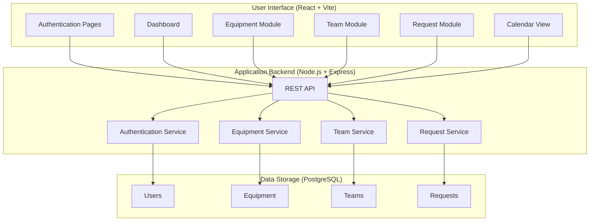

# GearGuard: The Ultimate Maintenance Tracker

GearGuard is a comprehensive, modern, and intuitive maintenance management system designed to track equipment, manage maintenance teams, and streamline maintenance requests. This document provides a complete overview of the project, its purpose, architecture, and how to get it up and running.

## The Problem: Taming the Maintenance Chaos

In today's fast-paced industrial and operational environments, the reliability of equipment is paramount. However, in many organizations, tracking equipment maintenance is a chaotic and fragmented process. Teams often find themselves wrestling with a patchwork of outdated tools and manual methods, such as spreadsheets, emails, and even sticky notes. This disorganization isn't just an inconvenience; it's a significant drain on resources and a threat to operational stability.

This traditional approach inevitably leads to a host of problems:
-   **Lost Revenue:** Unexpected equipment downtime directly translates to lost production and, consequently, lost revenue.
-   **Increased Costs:** A reactive approach to maintenance means dealing with emergencies as they arise, which is far more expensive than performing planned, preventive maintenance.
-   **Lack of Visibility:** Without a centralized system, it's nearly impossible to get a clear picture of an asset's maintenance history. This makes it difficult to make informed, data-driven decisions about whether to repair or replace equipment.
-   **Inefficient Team Management:** Managers struggle to assign tasks effectively, track technician workload, and ensure that the right people are working on the right tasks.
-   **Poor Communication:** The gap between equipment operators who report issues and the maintenance teams who fix them leads to delays, misunderstandings, and frustration.

## Our Solution: GearGuard - A Unified Command Center for Maintenance

GearGuard was born out of the need to bring order to this chaos. It is a centralized, digital platform that transforms maintenance operations by providing a single source of truth for all maintenance-related activities. Our vision is to empower organizations to transition from a reactive, "fire-fighting" mode to a proactive, predictive maintenance strategy. This shift not only saves time and money but also significantly improves overall operational efficiency and asset longevity.

Our approach is grounded in modern software engineering principles, featuring a clear separation between the frontend and backend to ensure scalability, flexibility, and maintainability.

-   **Intuitive and Responsive User Interface:** We believe that powerful software doesn't have to be complicated. GearGuard's user interface is meticulously crafted with **React** and **Tailwind CSS**. It is clean, intuitive, and fully responsive, ensuring a seamless experience whether you're on a desktop in the office or on a tablet on the shop floor.
-   **Powerful and Scalable Backend:** The backbone of GearGuard is a robust backend service built with **Node.js** and **Express**. This provides a secure, fast, and scalable REST API that handles all the business logic and data processing, capable of supporting a growing number of users and assets.
-   **Rock-Solid Data Integrity:** At the core of GearGuard lies a **PostgreSQL** database, renowned for its reliability and performance. We use the **Prisma ORM** to manage our database schema and interactions, which provides an additional layer of type safety and ensures that our data remains consistent and accurate.
-   **Real-time Collaboration:** With features like the interactive **Kanban board**, teams can visualize their workflow and track the status of maintenance requests in real-time. This transparency enhances collaboration and keeps everyone on the same page.

## Key Features

-   **Centralized Dashboard:** The first thing you see when you log in is a comprehensive dashboard that gives you a bird's-eye view of your entire maintenance operation. Key statistics, recent activity, and overdue tasks are immediately visible, allowing you to spot trends and potential issues at a glance.
-   **Detailed Equipment Management:** Keep an exhaustive record of every piece of equipment. Track serial numbers, specifications, purchase dates, warranty information, and a complete maintenance history for every asset in your inventory.
-   **Efficient Maintenance Team Management:** Create and organize your maintenance teams. Assign team leads, add technicians, and define specializations so that work orders are always routed to the team with the right skills.
-   **Streamlined Maintenance Requests:** The Kanban-style board makes it incredibly simple to submit, track, and manage maintenance requests from initiation to completion. Drag-and-drop functionality allows you to update the status of a request as it moves through the workflow (New, In Progress, Repaired, Scrap).
-   **Proactive Preventive Maintenance:** The integrated calendar view is your tool for scheduling and tracking recurring preventive maintenance tasks. This proactive approach helps you prevent failures before they happen, extending the life of your equipment and reducing unplanned downtime.
-   **Insightful Reporting & Analytics:** Move beyond guesswork. Generate detailed reports on equipment downtime, maintenance costs, team performance, and more. These insights are crucial for optimizing your maintenance strategy and justifying budget decisions.
-   **Granular User Roles & Permissions:** Maintain control over your data with a flexible role-based access control system. Define what different users (Admins, Managers, Technicians, and standard Users) can see and do within the application.

## System Architecture

The system is designed with a modern, decoupled architecture. This separation of concerns between the frontend presentation layer, the backend application logic, and the database layer allows for independent development, scaling, and maintenance of each component.



## Technology Stack

-   **Frontend:** React, Vite, TypeScript, Tailwind CSS, Axios
-   **Backend:** Node.js, Express, TypeScript, Prisma
-   **Database:** PostgreSQL
-   **Authentication:** JWT, bcrypt
-   **Development Tools:** Docker, ESLint, Prettier

## Getting Started

### Prerequisites

-   [Node.js](https://nodejs.org/) (v18 or later)
-   [npm](https://www.npmjs.com/)
-   [Docker](https://www.docker.com/) and [Docker Compose](https://docs.docker.com/compose/)

### Installation & Setup

1.  **Clone the Repository:**
    ```bash
    git clone https://github.com/your-username/gearguard.git
    cd gearguard
    ```

2.  **Configure Environment Variables:**
    -   In the `backend` directory, copy the `.env.example` file to a new file named `.env`.
    -   Update the `DATABASE_URL` in your new `.env` file with your PostgreSQL connection string. The default settings should work with the provided Docker setup.

3.  **Launch the Database:**
    -   From the project root, run the following command to start the PostgreSQL database container in the background:
        ```bash
        docker-compose up -d
        ```

4.  **Install Dependencies and Run Migrations:**
    -   Navigate to the backend, install its dependencies, and apply the database schema.
        ```bash
        cd backend
        npm install
        npx prisma migrate dev
        ```
    -   Navigate to the frontend and install its dependencies.
        ```bash
        cd ../frontend
        npm install
        ```

### Running the Application

1.  **Start the Backend Server:**
    ```bash
    cd backend
    npm run dev
    ```
    The backend API will be running at `http://localhost:5000`.

2.  **Start the Frontend Application:**
    ```bash
    cd frontend
    npm run dev
    ```
    The frontend will be accessible in your browser at `http://localhost:3000`.

## Contributing

We enthusiastically welcome contributions from the community! If you have an idea for a new feature, a bug fix, or an improvement to the documentation, we would love to have your help. Please read our [Contributing Guidelines](CONTRIBUTING.md) for a detailed guide on how to get involved.

## License

This project is licensed under the MIT License. See the [LICENSE](LICENSE) file for more details.